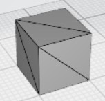
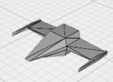

# 3D render using HLS

## Introduction

This is the project of fpgacamp2023. The project build a 3D render accelerator ip using HLS. Then create ZYNQ block design to run the system. Using PYNQ, we can call the ip and render the 3d model quickly. See more information and start the project from ./jupyter/threed_render_sw.ipynb.

## Environment

Win10 22H2 19045.3208, Vvivado 2022.2.2, Vitis HLS 2022.2.2, PYNQ-Z2 broad, PYNQ 2.7.

## Demo

Example origin model:

Example render effect:

## Author

Meng Weixuan, ShanghaiTech University.
